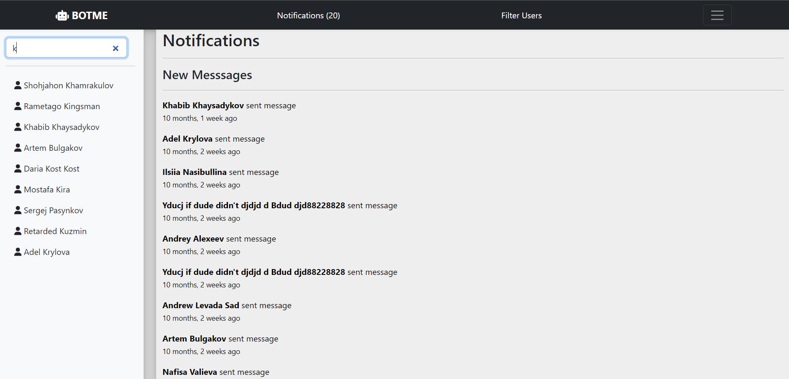
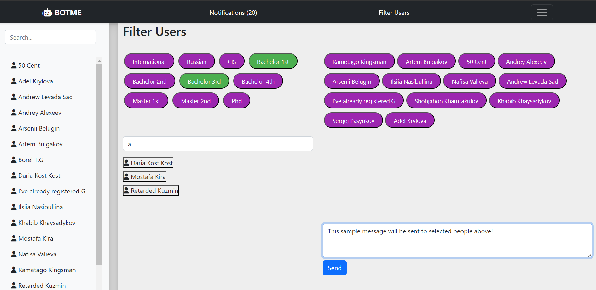

# Contact-UI-Platform (BOTME)




### Language: python 3.9 +

### Frameworks : Django 4+, TelegramBot


# About
Platform to contact with students Via Telegram, but doesn't require username, only telegram id is enough. or you can also send email from same platform. All registered students you can search and write your text on this platform, it sends that student via telegram bot or email, it will be also easier to automate and schedule messages.


## Group Filtering page: 


## Person profile page: 


## Chat page: 


# Project Setup

## Process

Found raw data from kaggle in csv format, cleared, filtered and added to database. 

Read DRI research paper and filtered values to calculate Daily Recommended consumption. 

#### Django project run

```bash
>>> python manage.py runserver
```

# Architecture

```
.
└── app
    └── nutrition
        ├──  migrations
        ├──  __init__.py
        ├──  admin.py
        ├──  apps.py
        ├──  models.py
        ├──  serializer.py
        ├──  service.py
        ├──  tests.py
        ├──  urls.py
        ├──  views.py
        ├──  telegrambot.py
    └──  config
        ├──  __init__.py
        ├──  asgi.py
        ├──  urls.py
        ├──  settings.py
        ├──  wsgi.py
        
    ├── .gitignore
    ├── .gitlab-ci.yml
    ├──  manage.py
    ├──  requirements.txt
```

### models.py

```python
from core.base_model import BaseModel
from django.db import models


class MyModel(BaseModel):
    name = models.CharField(max_length=255)

    def __str__(self):
        return self.name
```

### views.py

## urls.py

```python
from django.urls import path

'from .views import MyView'

urlpatterns = [
    path("article/", views.article, name="article"),
]
```

### main.urls.py

```python
from django.urls import path, include

urlpatterns = [
    path('/api/v1/{app_name}/', include('{app_name.urls}'))
]
```


## NOTE: This project can be modified and made for other organizations to contact with employees or students.
Contact me in this case! Telegram: @rametago